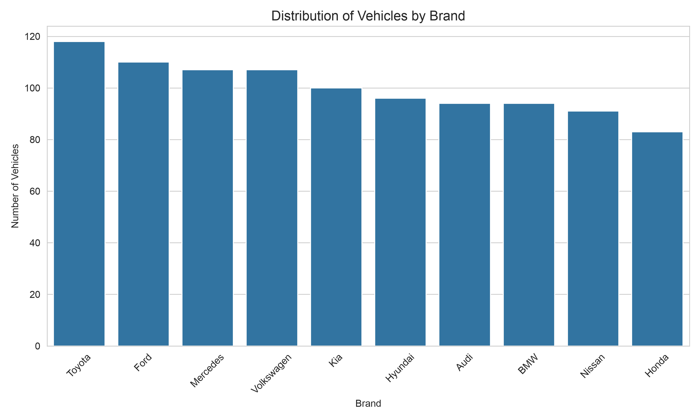
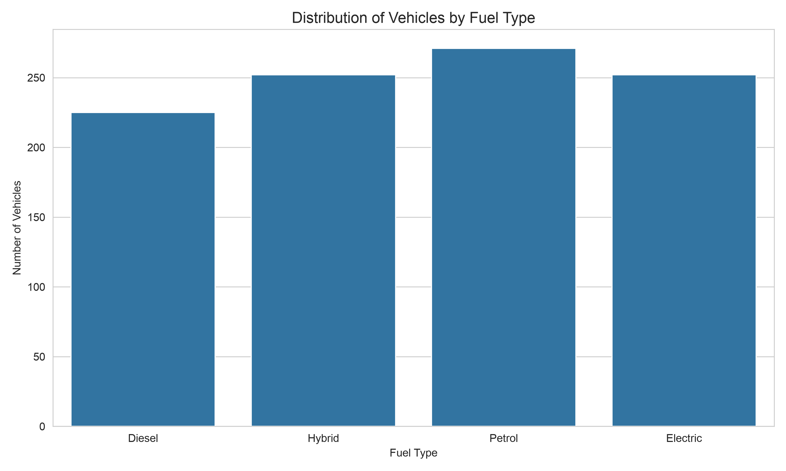
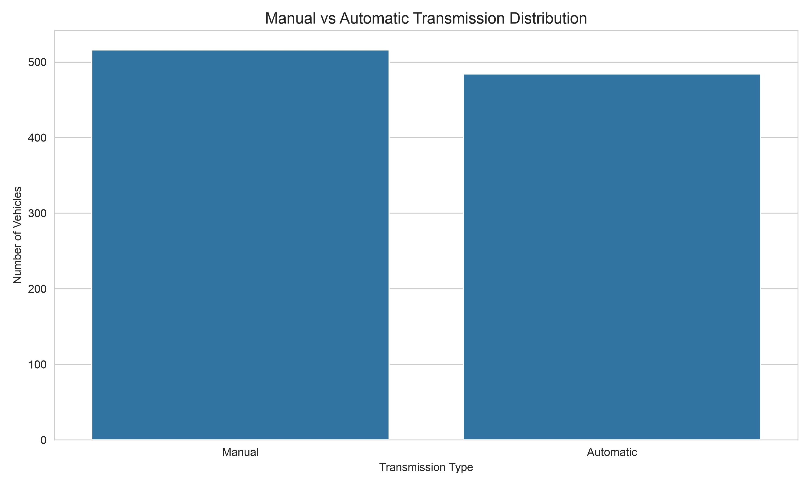
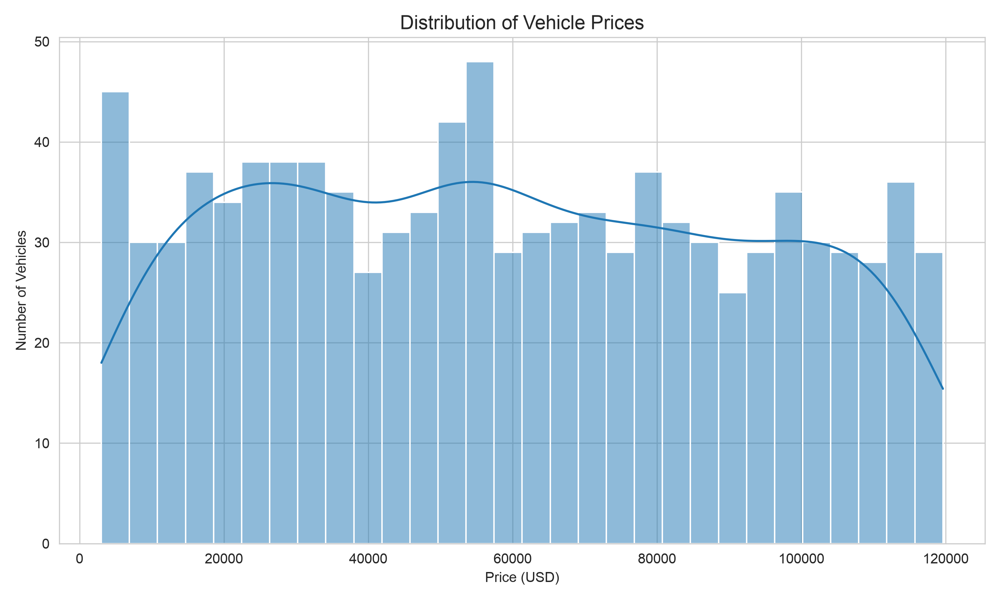
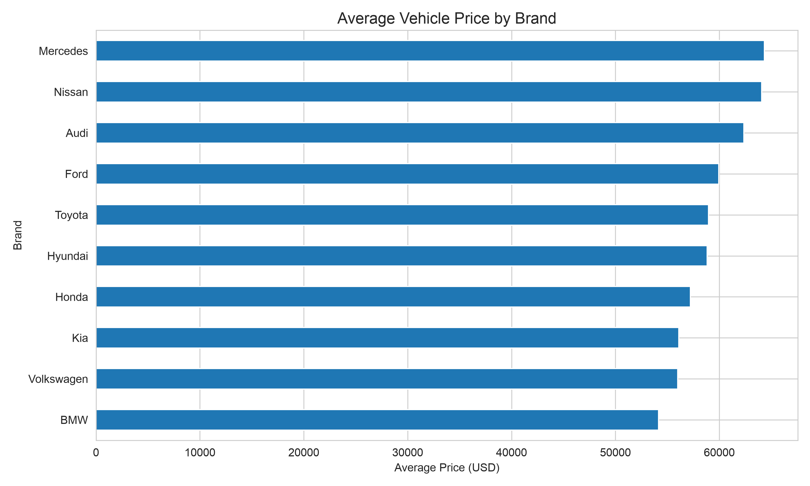
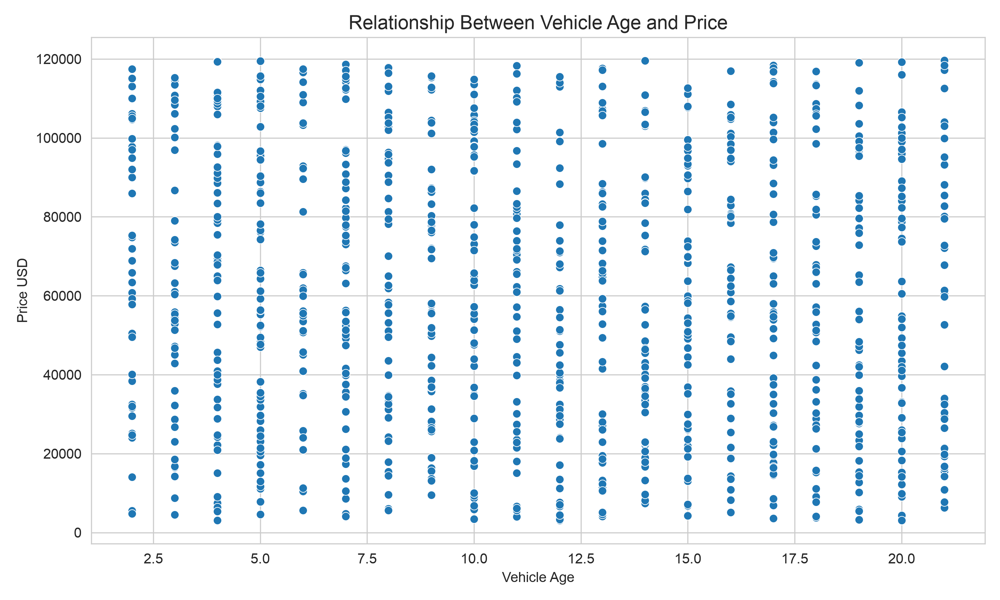

#  Consumer Preferences in the Automotive Market

## Project Overview

This is a personal practice project that explores the relationship between vehicle characteristics, market pricing, and consumer preferences within the used automotive market. Using Python for exploratory data analysis (EDA), the project investigates how attributes such as brand, vehicle age, fuel type, transmission, mileage, and engine performance are associated with vehicle prices and what these patterns may suggest about consumer value perception and market positioning.

Rather than focusing solely on technical analysis, this project interprets the findings from a **marketing and consumer behaviour perspective**, demonstrating how data can support strategic decision-making in the automotive industry.

---

## Business Problem

The used automotive market is highly competitive, with consumers evaluating vehicles based on numerous characteristics such as brand, age, mileage, transmission type, fuel type, and engine performance. Understanding which characteristics are associated with higher market prices can help manufacturers, dealerships, and marketers better position their products, optimise pricing strategies, and respond to evolving consumer preferences.

This project analyses used vehicle data to identify pricing patterns and interpret what these relationships may suggest about consumer behaviour within the automotive market.
**Data was sourced from Kaggle.** 
---

## Project Objectives

The primary objective of this project was to investigate the relationship between vehicle characteristics and market pricing while interpreting the results through a consumer behaviour and marketing lens.

Key objectives included:

* Analyzing pricing trends across manufacturers.
* Investigating the influence of vehicle age and mileage on resale value.
* Exploring the distribution of fuel types and transmission types.
* Comparing average prices across automotive brands.
* Examining relationships between vehicle characteristics and market value.
* Providing business recommendations based on analytical findings.

---

## Dataset

The dataset consists of **1,000 used vehicles** across **10 automotive manufacturers** and contains both technical specifications and market information.

### Variables

**Numerical**

* Car ID
* Model Year
* Kilometers Driven
* Engine Capacity (CC)
* Maximum Power (bhp)
* Fuel Efficiency (km/L)
* Number of Seats
* Price (USD)

**Categorical**

* Brand
* Fuel Type
* Transmission
* Owner Type

---

##  Technologies Used

* Python
* Pandas
* NumPy
* Matplotlib
* Seaborn
* Git
* GitHub

---

## Project Workflow

### 1. Project Planning

* Defined the business problem
* Established project objectives
* Identified stakeholders
* Developed project success criteria

### 2. Data Understanding

* Inspected dataset structure
* Reviewed variable types
* Assessed missing values
* Checked for duplicate observations

### 3. Data Preparation

* Created a working dataset
* Performed feature engineering
* Created additional analytical variables including:

  * Vehicle Age
  * Price per Horsepower
  * Brand Segment
  * Mileage Category
  * Age Category

### 4. Exploratory Data Analysis

Explored relationships between:

* Vehicle manufacturers
* Fuel types
* Transmission types
* Vehicle prices
* Brand positioning
* Vehicle age and pricing

---

# Key Visualisations & Insights

## 1. Brand Distribution


**Insight**

Toyota had the largest representation within the dataset, although all manufacturers were relatively well represented, allowing meaningful comparisons across brands.

---

## 2. Fuel Type Distribution


**Insight**

Petrol vehicles represented the largest proportion of listings, while Hybrid and Electric vehicles also showed substantial representation, reflecting an increasingly diverse automotive market.

---

## 3. Transmission Distribution


**Insight**

Manual and Automatic transmissions were similarly represented, suggesting manufacturers continue to serve multiple consumer segments with differing driving preferences.

---

## 4. Vehicle Price Distribution



**Insight**

Vehicle prices covered a broad range, indicating the presence of both budget and premium market segments.

---

## 5. Average Vehicle Price by Brand



**Insight**

Mercedes recorded the highest average vehicle price within this dataset, while BMW recorded the lowest average price. These differences suggest varying levels of market positioning and perceived value across manufacturers.

---

## 6. Vehicle Age vs Price


**Insight**

Vehicle prices generally decreased as vehicle age increased, demonstrating the influence of depreciation on resale value while highlighting that other vehicle characteristics also contribute to pricing.

---

# Key Findings

The analysis identified several notable trends:

* Premium manufacturers generally commanded higher average vehicle prices.
* Vehicle age demonstrated a negative relationship with resale value.
* The market contained a balanced representation of fuel technologies and transmission types.
* Multiple vehicle characteristics contribute to pricing, indicating that consumer value perception is influenced by a combination of technical specifications and brand-related factors.
* The dataset supports meaningful comparisons between manufacturers due to its balanced distribution across brands.

---

# Business Insights

From a marketing perspective, the findings suggest that:

* Strong brand positioning may enable manufacturers to sustain higher market prices.
* Consumers may associate newer vehicles with greater reliability and perceived quality.
* Brand equity and perceived value appear to play an important role in pricing.
* Manufacturers should continue differentiating products through performance, technology, quality, and branding strategies.

---

#  Limitations

Several limitations should be considered when interpreting the findings:

* The dataset represents vehicle listings rather than completed sales transactions.
* The analysis identifies relationships but does not establish causal relationships.
* Variables such as geographic location, vehicle condition, optional features, and economic conditions were not available.
* Results should therefore be interpreted within the context of the dataset.

---

# Future Improvements

Potential extensions of this project include:

* Building machine learning models to predict vehicle prices.
* Performing customer segmentation using clustering techniques.
* Analysing regional differences in pricing.
* Investigating the influence of additional vehicle features on market value.
* Developing an interactive dashboard using Power BI or Tableau.

---

# Repository Structure

```text
consumer-preferences-automotive-market/

├── data/
│   ├── used_car_dataset.csv
│   └── used_car_dataset_clean.csv
│
├── images/
│   ├── brand_distribution.png
│   ├── fuel_type_distribution.png
│   ├── transmission_distribution.png
│   ├── price_distribution.png
│   ├── average_price_brand.png
│   └── age_vs_price.png
│
├── reports/
│   └── Consumer_Preferences_in_the_Automotive_Market_Report.pdf
│
├── DATA_QUALITY_REPORT.md
├── PROJECT_PLAN.md
├── main.py
├── requirements.txt
├── README.md
└── .gitignore
```

